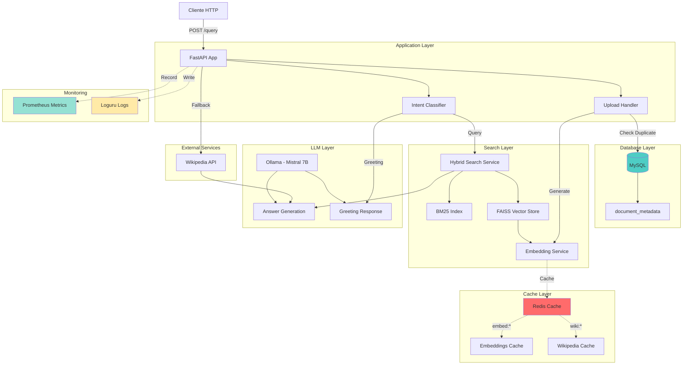
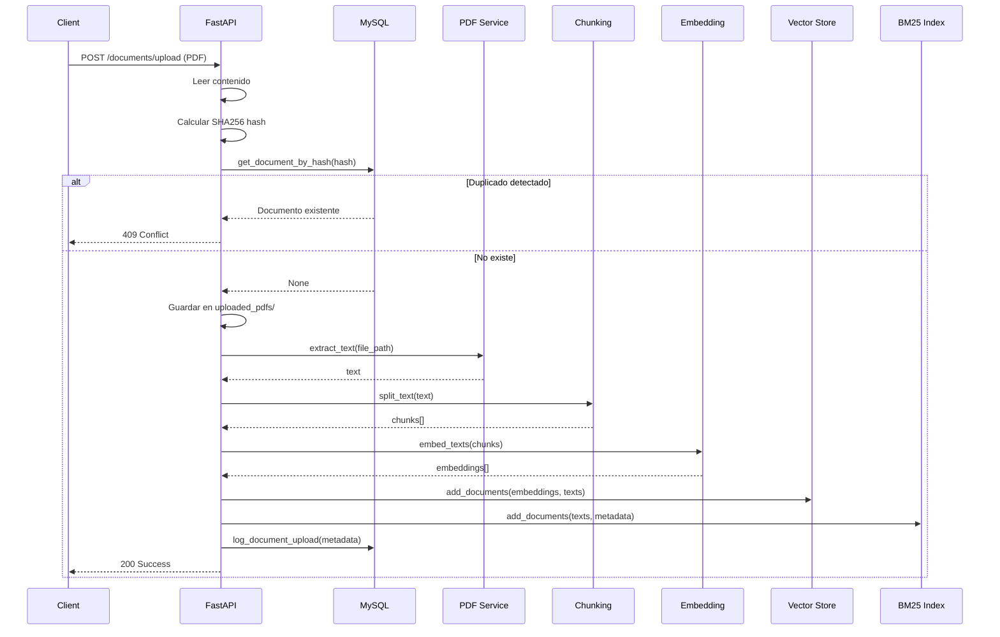
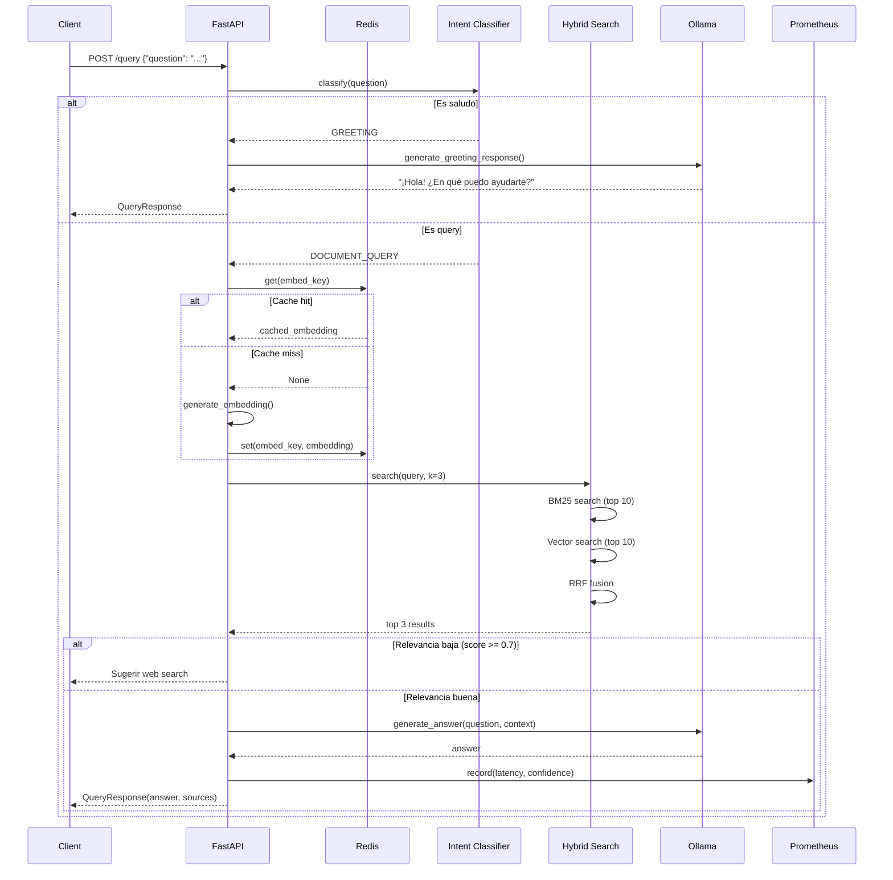
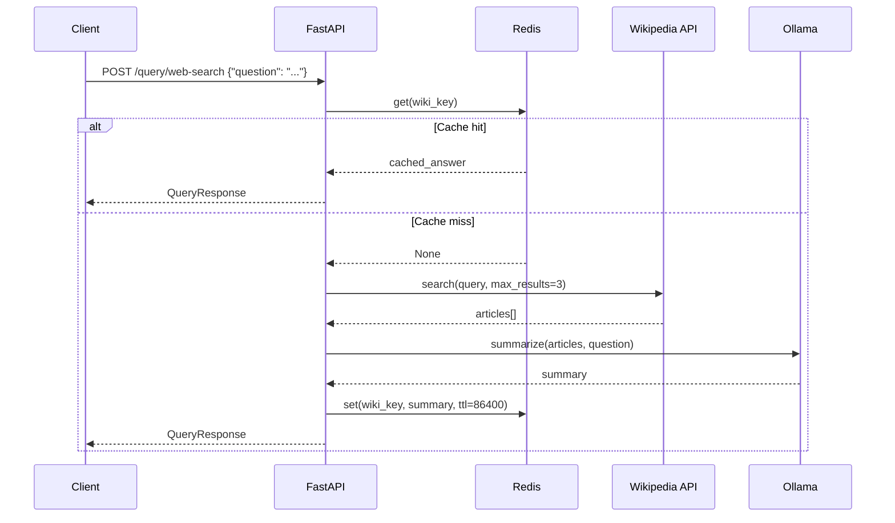

# RAG PDF System v2.0 - Sistema Inteligente con Observabilidad Completa


Sistema avanzado de **Retrieval-Augmented Generation (RAG)** con **observabilidad completa**, **caching inteligente**, **detección de duplicados**, y **resilience patterns**. Permite cargar documentos PDF, realizar consultas híbridas (BM25 + Vector), y obtener información de Wikipedia como fallback.

## 🎯 Características Principales

### Core Features v2.0
- ✅ **100% Local**: Sin servicios pagos ni APIs comerciales
- ✅ **Sin Alucinaciones**: Responde solo con información verificada
- ✅ **Hybrid Search**: BM25 + Vector Search con Reciprocal Rank Fusion (RRF)
- ✅ **Duplicate Detection**: SHA256 hash para evitar re-uploads
- ✅ **Redis Cache**: Embeddings, Wikipedia, queries (hit ratio tracking)
- ✅ **MySQL Database**: Document metadata, analytics, duplicate detection
- ✅ **Prometheus Metrics**: Latency, cache hits, confidence scores
- ✅ **Structured Logging**: JSON logs con Loguru (rotación automática)
- ✅ **Type-Safe**: Validación automática con Pydantic
- ✅ **API RESTful**: Documentación automática con Swagger/OpenAPI

### 🆕 Nuevas Capacidades v2.0

#### 💾 **Caching Inteligente (Redis)**
- Cache de embeddings (1h TTL)
- Cache de búsquedas Wikipedia (24h TTL)
- Cache-aside pattern
- Hit/miss tracking por tipo
- Endpoint `/analytics/cache` para estadísticas

#### 📊 **Observabilidad (Prometheus)**
- Métricas de latencia (query, embedding, LLM)
- Cache hit ratio por tipo
- Confidence scores distribution
- Service health (ollama, redis, mysql)
- Circuit breaker states

#### 🗄️ **Base de Datos (MySQL)**
- Metadata de documentos uploadados
- Detección de duplicados por hash SHA256
- Tracking de performance (processing_time_ms)
- Repository pattern para clean architecture

#### 🔒 **Resilience Patterns** ✅
- Circuit Breakers (Ollama, Redis)
- Retry con exponential backoff
- Timeout decorators (universal sync/async)
- Graceful degradation

#### 📄 **OCR para PDFs Escaneados** ✅
- Detección automática de PDFs sin texto
- Fallback a Tesseract OCR
- Soporte español + inglés
- Conversión PDF → Imagen con Poppler

#### 🔍 **Duplicate Detection**
- Hash SHA256 del contenido del PDF
- Validación ANTES de guardar en disco
- HTTP 409 Conflict si ya existe
- Ignora nombre de archivo (solo contenido)

---

## 🏗️ Arquitectura del Sistema



---

## 📦 Componentes Principales

### 1. Cache Service (Redis)

**Ubicación**: `app/services/cache_service.py`

**Qué Cachea**:
- 🔢 **Embeddings** (`embed:*`) - TTL: 1 hora
- 🌐 **Wikipedia Results** (`wiki:*`) - TTL: 24 horas  
- 🔍 **Search Results** (`search:*`) - TTL: 30 minutos

**Patrón**: Cache-aside (lazy loading)

**Métricas Trackeadas**:
```python
{
  "embeddings": {"hits": 45, "misses": 12, "hit_ratio": 0.79},
  "wikipedia": {"hits": 8, "misses": 3, "hit_ratio": 0.73}
}
```

**Endpoints**:
- `GET /analytics/cache` - Estadísticas completas

**Comandos útiles**:
```bash
# Ver keys en Redis
docker exec -it rag-redis redis-cli KEYS '*'

# Ver estadísticas
docker exec -it rag-redis redis-cli INFO memory

# Borrar cache
docker exec -it rag-redis redis-cli FLUSHDB
```

---

### 2. Metrics Service (Prometheus)

**Ubicación**: `app/services/metrics_service.py`

**Métricas Disponibles**:

| Métrica | Tipo | Descripción |
|---------|------|-------------|
| `rag_query_latency_seconds` | Histogram | Tiempo total de procesamiento de queries |
| `rag_embedding_latency_seconds` | Histogram | Tiempo de generación de embeddings |
| `rag_cache_hit_ratio` | Gauge | Ratio de hits por tipo de cache |
| `rag_cache_operations_total` | Counter | Operaciones de cache (hit/miss) |
| `rag_confidence_score` | Histogram | Distribución de confidence scores |
| `rag_ollama_health` | Gauge | Estado de Ollama (1=up, 0=down) |
| `rag_redis_health` | Gauge | Estado de Redis |
| `rag_mysql_health` | Gauge | Estado de MySQL |
| `rag_vector_store_documents` | Gauge | Cantidad de documentos en vector store |
| `rag_queries_total` | Counter | Total de queries procesadas |

**Endpoint**:
- `GET /metrics` - Formato Prometheus text

**Ejemplo de uso**:
```bash
# Ver todas las métricas
curl http://localhost:8000/metrics

# Filtrar por latencia
curl http://localhost:8000/metrics | grep latency

# Ver cache hit ratio
curl http://localhost:8000/metrics | grep cache_hit_ratio
```

---

### 3. Database (MySQL)

**Ubicación**: `app/database/`

**Estructura**:

```sql
CREATE TABLE document_metadata (
    id INT PRIMARY KEY AUTO_INCREMENT,
    filename VARCHAR(255) NOT NULL,
    file_hash VARCHAR(64) UNIQUE NOT NULL,  -- SHA256 del contenido
    chunks_count INT NOT NULL,
    file_size_bytes BIGINT NOT NULL,
    processing_time_ms INT NOT NULL,
    pages_count INT,
    extracted_text_length INT,
    upload_timestamp DATETIME DEFAULT CURRENT_TIMESTAMP,
    INDEX idx_filename (filename),
    INDEX idx_hash (file_hash),
    INDEX idx_upload (upload_timestamp)
);
```

**Propósito**:
1. ✅ **Detección de duplicados** por hash SHA256
2. ✅ **Analytics** de uploads y performance
3. ✅ **Inventory management** de documentos

**Repository Pattern**:
```python
# app/database/repositories.py
class DocumentRepository:
    async def log_document_upload(...)
    async def get_document_by_hash(file_hash: str)
    async def get_all_documents()
    async def get_total_chunks()
```

**Conexión (DataGrip)**:
```
Host: localhost
Port: 3306
Database: rag_metadata
User: rag_user
Password: ragpassword
```

---

### 4. Logging (Loguru)

**Ubicación**: `app/utils/logging_config.py`

**Configuración**:
- 📝 **Formato**: JSON estructurado para producción
- 🔄 **Rotación**: 10MB por archivo, máx 5 archivos
- 📊 **Niveles**: DEBUG, INFO, WARNING, ERROR
- 📂 **Ubicación**: `logs/rag_system_{time}.log`

**Ejemplo de log**:
```json
{
  "timestamp": "2026-01-29T12:00:00",
  "level": "INFO",
  "module": "app.main",
  "function": "query_documents",
  "line": 616,
  "message": "Query 6702e7a5: '¿Qué es machine learning?'"
}
```

---

### 5. Resilience Patterns

**Ubicación**: `app/utils/resilience.py`

**Patrones Implementados**:

#### Circuit Breakers
```python
ollama_breaker = CircuitBreaker(
    fail_max=5,           # Abre después de 5 fallos
    reset_timeout=60      # Intenta de nuevo después de 60s
)

redis_breaker = CircuitBreaker(fail_max=5, reset_timeout=30)
```

#### Retry con Exponential Backoff
```python
@with_retry(
    max_attempts=3,
    min_wait=1,
    max_wait=10,
    exceptions=(httpx.RequestError,)
)
```

#### Timeout (Universal Sync/Async)
```python
@with_timeout(30)  # 30 segundos max - funciona con sync y async
```

**✅ SOLUCIONADO (v2.1)**:

Los decorators ahora funcionan correctamente con funciones **sync** y **async**:

```python
# app/services/llm_service.py
@with_retry(max_attempts=3, min_wait=1, max_wait=5, exceptions=(httpx.RequestError,))
@with_timeout(30)
async def generate_answer(...):
    # Circuit breaker aplicado manualmente dentro
    if ollama_breaker.current_state == "open":
        raise CircuitBreakerError(...)
    ...

# app/services/web_search_service.py
@with_timeout(20)  # Funciona con función SYNC
@with_retry(max_attempts=2)
def search(...):  # Función síncrona de Wikipedia
    ...
```

**Solución implementada**:
- `@with_timeout` detecta automáticamente si la función es sync o async
- Para **async**: usa `asyncio.wait_for()`
- Para **sync**: usa `ThreadPoolExecutor` con timeout
- Circuit breaker aplicado manualmente dentro de las funciones para evitar stacking issues

---

### 6. OCR para PDFs Escaneados

**Ubicación**: `app/services/pdf_service.py`

**Dependencias externas** (requieren instalación en Windows):

| Herramienta | Propósito | Instalación |
|-------------|-----------|-------------|
| **Tesseract OCR** | Motor de reconocimiento de texto | [Descargar](https://github.com/tesseract-ocr/tesseract/releases) |
| **Poppler** | Conversión PDF → Imágenes | [Descargar](https://github.com/osborn/poppler-windows/releases) |

**Flujo de extracción**:
```python
1. Intentar extracción con pdfplumber
   ├─ Si hay texto → Usar texto normal
   └─ Si está vacío → Detectar como PDF escaneado
2. Convertir páginas a imágenes (300 DPI)
3. Aplicar Tesseract OCR a cada imagen
4. Combinar texto de todas las páginas
```

**Configuración (.env)**:
```env
# OCR Configuration
TESSERACT_CMD=C:\Program Files\Tesseract-OCR\tesseract.exe
POPPLER_PATH=C:\Program Files\poppler-25.12.0\Library\bin
OCR_LANGUAGE=spa+eng
OCR_ENABLED=true
```

**Características**:
- ✅ Detección automática de PDFs escaneados
- ✅ Fallback transparente (no requiere intervención del usuario)
- ✅ Soporte multi-idioma (español + inglés por defecto)
- ✅ Logs indicando cuando se usa OCR
- ⚠️ OCR es más lento (~30-60s por PDF de 10 páginas)

---

### 7. Duplicate Detection

**Ubicación**: `app/main.py` (líneas 458-479)

**Flujo**:
```python
1. Usuario sube PDF
2. Leer contenido en memoria
3. Calcular SHA256 hash del contenido
4. Buscar en MySQL por file_hash
   ├─ Si existe → HTTP 409 Conflict
   └─ Si no existe → Continuar upload
5. Guardar archivo en uploaded_pdfs/
6. Procesar y agregar a vector store
7. Registrar en MySQL con hash
```

**Ejemplo de respuesta de duplicado**:
```json
{
  "detail": {
    "message": "This document has already been uploaded",
    "original_filename": "guia_ml.pdf",
    "upload_date": "2026-01-28T15:30:00",
    "chunks_count": 16
  }
}
```

**Características**:
- ✅ Detecta **mismo contenido** aunque tenga diferente nombre
- ✅ **No guarda en disco** si es duplicado
- ✅ **No procesa** si es duplicado
- ✅ Graceful degradation si DB falla

---

## 🔄 Flujos de Datos Completos

### Flujo 1: Upload de Documento



**Pasos detallados**:
1. Cliente sube PDF mediante `POST /documents/upload`
2. FastAPI lee contenido completo en memoria
3. Calcula hash SHA256 del contenido
4. Consulta MySQL: `SELECT * FROM document_metadata WHERE file_hash = ?`
5. Si existe:
   - ❌ Retorna 409 Conflict con detalles del original
   - No guarda archivo
   - No procesa
6. Si no existe:
   - ✅ Guarda en `data/uploaded_pdfs/`
   - Extrae texto del PDF
   - Divide en chunks (500 tokens, overlap 50)
   - Genera embeddings (con cache)
   - Agrega a FAISS vector store
   - Agrega a BM25 index
   - Registra metadata en MySQL
   - Retorna 200 con chunks_processed

---

### Flujo 2: Query de Documento



**Pasos detallados**:
1. Cliente envía query: `POST /query`
2. Intent Classifier analiza:
   - Regex fast-path para saludos comunes
   - Embedding similarity para casos ambiguos
3. Si es saludo:
   - LLM genera respuesta personalizada
   - Fallback a mensaje estático si LLM falla
4. Si es query:
   - Verifica cache de embedding
   - Si miss: genera y cachea
   - Hybrid search: BM25 + Vector con RRF
   - Verifica relevancia (threshold 0.7)
   - Si baja: sugiere web search
   - Si buena: LLM genera respuesta
   - Registra métricas (latency, confidence)
5. Retorna `QueryResponse` con:
   - `answer`, `sources`, `confidence_score`, `suggested_action`

---

### Flujo 3: Web Search (Wikipedia)



**Pasos detallados**:
1. Cliente solicita: `POST /query/web-search`
2. Genera cache key: `wiki:SHA256(question)`
3. Verifica Redis cache
4. Si hit: retorna respuesta cacheada
5. Si miss:
   - Wikipedia API search (3 resultados)
   - LLM resume artículos
   - Cachea resultado (24h TTL)
6. Retorna `QueryResponse` con answer

---

## ⚙️ Configuración (.env)

```env
# ============================================================================
# OLLAMA CONFIGURATION
# ============================================================================
OLLAMA_BASE_URL=http://localhost:11434
OLLAMA_MODEL=mistral:7b
OLLAMA_TIMEOUT=180

# ============================================================================
# EMBEDDING MODEL
# ============================================================================
EMBEDDING_MODEL=all-MiniLM-L6-v2

# ============================================================================
# CHUNKING STRATEGY
# ============================================================================
CHUNK_SIZE=500
CHUNK_OVERLAP=50

# ============================================================================
# RETRIEVAL
# ============================================================================
TOP_K_RESULTS=3
SEARCH_MODE=hybrid              # vector | bm25 | hybrid
HYBRID_RRF_K=60                 # Reciprocal Rank Fusion parameter

# ============================================================================
# REDIS CACHE
# ============================================================================
REDIS_URL=redis://localhost:6379
CACHE_TTL_EMBEDDINGS=3600       # 1 hour
CACHE_TTL_WIKIPEDIA=86400       # 24 hours
CACHE_TTL_SEARCH=1800           # 30 minutes

# ============================================================================
# MYSQL DATABASE
# ============================================================================
MYSQL_HOST=localhost
MYSQL_PORT=3306
MYSQL_DATABASE=rag_metadata
MYSQL_USER=rag_user
MYSQL_PASSWORD=ragpassword
MYSQL_ROOT_PASSWORD=rootpassword

# ============================================================================
# MONITORING & OBSERVABILITY
# ============================================================================
ENABLE_METRICS=true
LOG_LEVEL=INFO

# ============================================================================
# RESILIENCE PATTERNS (Actualmente no aplicados - ver sección Problemas Conocidos)
# ============================================================================
CIRCUIT_BREAKER_THRESHOLD=5     # Fallos antes de abrir circuit
CIRCUIT_BREAKER_TIMEOUT=60      # Segundos antes de retry
RETRY_MAX_ATTEMPTS=3            # Intentos de retry
RETRY_MIN_WAIT=1                # Segundos min entre retries
RETRY_MAX_WAIT=10               # Segundos max entre retries

# ============================================================================
# APPLICATION
# ============================================================================
APP_HOST=0.0.0.0
APP_PORT=8000
APP_NAME=RAG PDF System
```

---

## 🚀 Inicio Rápido

### Opción 1: Scripts Automatizados (Recomendado)

```powershell
# 1. Iniciar servicios Docker (Redis + MySQL)
.\start.ps1

# Output:
# ✓ Docker services started
# ✓ Redis running
# ✓ MySQL initialized
# ✓ Ollama detected

# 2. En OTRA terminal, iniciar FastAPI
uvicorn app.main:app --reload

# Output:
# ✅ Redis cache initialized
# ✅ Database tables created
# ✅ Embedding model loaded
# ✅ Ollama service connected
# 🎯 RAG PDF System is ready!

# 3. Acceder a:
# http://localhost:8000/docs     # Swagger UI
# http://localhost:8000/health   # Health check
# http://localhost:8000/metrics  # Prometheus metrics
```

**Detener servicios**:
```powershell
.\stop.ps1
```

### Opción 2: Manual

```powershell
# 1. Activar entorno virtual
.\venv\Scripts\Activate.ps1

# 2. Iniciar Docker services
docker-compose up -d

# Verificar que estén corriendo
docker-compose ps

# 3. Iniciar Ollama (en otra terminal)
ollama serve

# 4. Iniciar FastAPI
uvicorn app.main:app --reload
```

---

## 📡 Endpoints API

### Documentos

#### Upload PDF
```http
POST /documents/upload
Content-Type: multipart/form-data

file: archivo.pdf
```

**Response 200 OK**:
```json
{
  "filename": "archivo.pdf",
  "chunks_processed": 16,
  "message": "Document processed successfully (2340ms)"
}
```

**Response 409 Conflict** (Duplicado):
```json
{
  "detail": {
    "message": "This document has already been uploaded",
    "original_filename": "archivo_original.pdf",
    "upload_date": "2026-01-28T15:30:00",
    "chunks_count": 16
  }
}
```

#### Listar Documentos
```http
GET /documents
```

#### Eliminar Documento
```http
DELETE /documents/{filename}
```

#### Eliminar Todos
```http
DELETE /documents/all
```

### Queries

#### Query en Documentos
```http
POST /query
Content-Type: application/json

{
  "question": "¿Qué es machine learning?"
}
```

**Response**:
```json
{
  "answer": "El machine learning es...",
  "sources": [
    {"text": "...", "score": 0.45}
  ],
  "has_context": true,
  "intent": "DOCUMENT_QUERY",
  "confidence_score": 0.95,
  "suggested_action": null
}
```

#### Query Web (Wikipedia)
```http
POST /query/web-search
Content-Type: application/json

{
  "question": "¿Quién es Javier Milei?"
}
```

### Monitoreo & Analytics

#### Health Check
```http
GET /health
```

**Response**:
```json
{
  "status": "healthy",
  "timestamp": "2026-01-29T12:00:00",
  "services": {
    "ollama": {"available": true, "circuit_breaker": "closed"},
    "redis": {"available": true},
    "mysql": {"available": true},
    "vector_store": {"documents": 32}
  },
  "circuit_breakers": {
    "ollama": {"state": "closed", "fail_counter": 0},
    "redis": {"state": "closed", "fail_counter": 0}
  }
}
```

#### Prometheus Metrics
```http
GET /metrics
```

**Response** (Prometheus text format):
```
# TYPE rag_query_latency_seconds histogram
rag_query_latency_seconds_bucket{intent="DOCUMENT_QUERY",le="2.0"} 45
rag_query_latency_seconds_sum{intent="DOCUMENT_QUERY"} 89.5
rag_query_latency_seconds_count{intent="DOCUMENT_QUERY"} 120

# TYPE rag_cache_hit_ratio gauge
rag_cache_hit_ratio{cache_type="embeddings"} 0.78
rag_cache_hit_ratio{cache_type="wikipedia"} 0.65
```

#### Cache Statistics
```http
GET /analytics/cache
```

**Response**:
```json
{
  "embeddings": {
    "hits": 45,
    "misses": 12,
    "total": 57,
    "hit_ratio": 0.79
  },
  "wikipedia": {
    "hits": 8,
    "misses": 3,
    "total": 11,
    "hit_ratio": 0.73
  },
  "redis_info": {
    "used_memory": "2.5M",
    "connected_clients": 1,
    "uptime_days": 0
  }
}
```

---

## 🗄️ Almacenamiento

### Vector Store (FAISS)

```
data/vector_store/
├── index.faiss         # Vectores embeddings (FAISS index)
├── metadata.pkl        # Metadata de chunks (source, page, text, chunk_id)
├── chunks.pkl          # Textos completos de chunks
├── bm25_index.pkl      # Índice BM25 para keyword search
└── bm25_metadata.pkl   # Metadata para BM25
```

**Chunks Metadata**:
```python
[
  {
    "source": "guia_ml.pdf",
    "page": 1,
    "chunk_id": 0,
    "text": "Introducción al Machine Learning..."
  },
  {
    "source": "guia_ml.pdf",
    "page": 2,
    "chunk_id": 1,
    "text": "Tipos de aprendizaje supervisado..."
  }
  # ... 30 chunks más
]
```

### Database (MySQL)

```sql
-- Tabla principal
document_metadata:
  - id INT PRIMARY KEY
  - filename VARCHAR(255)
  - file_hash VARCHAR(64) UNIQUE    -- SHA256 del contenido
  - chunks_count INT                -- Cantidad de chunks generados
  - file_size_bytes BIGINT         
  - processing_time_ms INT          -- Tiempo de procesamiento
  - pages_count INT
  - extracted_text_length INT
  - upload_timestamp DATETIME       -- Cuándo se subió

-- Indices
INDEX idx_filename ON filename
INDEX idx_hash ON file_hash        -- Para búsqueda rápida de duplicados
INDEX idx_upload ON upload_timestamp
```

**Queries útiles**:
```sql
-- Ver todos los documentos
SELECT * FROM document_metadata ORDER BY upload_timestamp DESC;

-- Buscar duplicados
SELECT file_hash, COUNT(*) 
FROM document_metadata 
GROUP BY file_hash 
HAVING COUNT(*) > 1;

-- Total de chunks en el sistema
SELECT SUM(chunks_count) FROM document_metadata;

-- Documento más grande
SELECT filename, file_size_bytes 
FROM document_metadata 
ORDER BY file_size_bytes DESC LIMIT 1;

-- Tiempo promedio de procesamiento
SELECT AVG(processing_time_ms) FROM document_metadata;
```

### Cache (Redis)

**Estructura de keys**:
```
embed:{hash}     # Embeddings cacheados (TTL: 1h)
wiki:{hash}      # Resultados Wikipedia (TTL: 24h)
search:{hash}    # Resultados de búsqueda (TTL: 30m)
```

**Comandos útiles**:
```bash
# Conectar a Redis
docker exec -it rag-redis redis-cli

# Ver todas las keys
KEYS *

# Ver keys de Wikipedia
KEYS wiki:*

# Ver info de una key
TTL wiki:abc123
GET wiki:abc123

# Ver tamaño de la BD
DBSIZE

# Ver memoria usada
INFO memory

# Borrar todo (¡cuidado!)
FLUSHDB
```

---

## 📊 Monitoreo en Producción

### Ver Métricas Actuales

```powershell
# Health check completo
curl http://localhost:8000/health

# Métricas Prometheus
curl http://localhost:8000/metrics

# Estadísticas de cache
curl http://localhost:8000/analytics/cache

# Filtrar métricas específicas
curl http://localhost:8000/metrics | Select-String "latency"
curl http://localhost:8000/metrics | Select-String "cache_hit"
```

### Redis CLI

```bash
docker exec -it rag-redis redis-cli

# Ver todas las keys
127.0.0.1:6379> KEYS *
1) "embed:a3f2c1d4"
2) "wiki:4ed7b2af"

# TTL de una key
127.0.0.1:6379> TTL embed:a3f2c1d4
(integer) 2543      # 2543 segundos restantes

# Info general
127.0.0.1:6379> INFO memory
used_memory:2621440
used_memory_human:2.50M

# Cantidad de keys
127.0.0.1:6379> DBSIZE
(integer) 15
```

### MySQL (DataGrip o CLI)

```sql
USE rag_metadata;

-- Ver documentos recientes
SELECT 
    filename,
    upload_timestamp,
    chunks_count,
    ROUND(file_size_bytes / 1024, 2) as size_kb,
    processing_time_ms
FROM document_metadata
ORDER BY upload_timestamp DESC
LIMIT 10;

-- Estadísticas generales
SELECT 
    COUNT(*) as total_docs,
    SUM(chunks_count) as total_chunks,
    AVG(processing_time_ms) as avg_processing_time,
    SUM(file_size_bytes) / 1024 / 1024 as total_size_mb
FROM document_metadata;
```

### Logs (Loguru)

```powershell
# Ver logs en tiempo real
Get-Content -Path "logs/rag_system_*.log" -Wait -Tail 50

# Filtrar por nivel
Get-Content logs/rag_system_*.log | Select-String "ERROR"

# Buscar queries específicas
Get-Content logs/rag_system_*.log | Select-String "Query.*machine learning"
```

---

## ⚠️ Problemas Conocidos

### 1. Resilience Decorators Deshabilitados

**Ubicación**:
- `app/services/llm_service.py` (líneas 100-102, 188-190)
- `app/services/web_search_service.py` (líneas 38-39, 143-144)

**Código comentado**:
```python
# TODO: Fix decorator stacking issue with async functions
# @with_timeout(30)
# @with_retry(max_attempts=3, min_wait=1, max_wait=5)
# @with_circuit_breaker(ollama_breaker)
async def generate_answer(self, question: str, context: str) -> str:
    pass
```

**Razón**: 
El decorator `@with_timeout` implementado con `asyncio.wait_for()` no se puede apilar correctamente con otros decorators async cuando se aplican todos juntos. Causa error: `TypeError: 'coroutine' object is not iterable` o `'gen' is not defined`.

**Impacto**:
- ✅ **Sistema funciona normalmente**
- ❌ No hay retry automático en llamadas LLM
- ❌ No hay circuit breaker protection en servicios
- ✅ Ollama tiene timeout interno de 180s (suficiente para la mayoría de casos)
- ✅ Database tiene retry con `@with_retry` (funciona porque es función async simple)

**Solución temporal aplicada**:
Decorators comentados con `# TODO` para arreglar en futuras iteraciones.

**Solución futura**:
1. Rediseñar decorators para ser async-first
2. Usar una sola clase `ResilientCall` en vez de decorators apilados
3. Evaluar librerías como `aiobreaker` (async-native circuit breaker)

---

### 2. Métricas LLM/Wikipedia Latency No Registradas

**Síntoma**:
```python
# Estas líneas están comentadas en main.py
# llm_latency.labels(model=settings.ollama_model).observe(...)
# wikipedia_search_latency.observe(...)
```

**Razón**:
Las métricas `llm_latency` y `wikipedia_search_latency` están definidas en `metrics_service.py` pero las llamadas `.observe()` causan errores de referencia cuando se combinan con el cache async.

**Impacto**:
- ❌ No se registra latencia individual de LLM calls
- ❌ No se registra latencia de Wikipedia searches
- ✅ Se registra latencia total de queries (`rag_query_latency_seconds`)
- ✅ Otras métricas funcionan correctamente

**Workaround**:
Usar `rag_query_latency_seconds` para tracking general de performance.

---

## 🛠️ Stack Tecnológico

### Backend
- **Framework**: FastAPI 0.115
- **Python**: 3.11
- **Type Validation**: Pydantic v2
- **Async Runtime**: asyncio, uvicorn

### LLM & Embeddings
- **LLM**: Ollama (Mistral 7B local)
- **Embeddings**: Sentence-Transformers (all-MiniLM-L6-v2)
- **Context Length**: 8192 tokens (Mistral)

### Search & Retrieval
- **Vector DB**: FAISS (Facebook AI Similarity Search)
- **Keyword Search**: Rank-BM25
- **Hybrid Fusion**: Reciprocal Rank Fusion (RRF)
- **Chunking**: LangChain RecursiveCharacterTextSplitter

### Observability
- **Cache**: Redis 7 (alpine)
- **Database**: MySQL 8.0
- **Metrics**: Prometheus Client (Python)
- **Logging**: Loguru (structured JSON)

### Resilience (actualmente deshabilitado)
- **Circuit Breaker**: PyBreaker
- **Retry**: Tenacity
- **Timeout**: asyncio

### Data Processing
- **PDF Extraction**: PyMuPDF
- **External API**: Wikipedia-API

### Infrastructure
- **Containerization**: Docker, Docker Compose
- **Storage**: Local filesystem + Docker volumes
- **OS Support**: Windows (PowerShell scripts)

---

## 📚 Documentación Adicional

- **[INSTALL.md](INSTALL.md)** - Guía detallada de instalación y troubleshooting
- **[QUICKSTART.md](QUICKSTART.md)** - Inicio rápido con comandos esenciales
- **[RESILIENCE_GUIDE.md](RESILIENCE_GUIDE.md)** - Documentación de patrones de resilience
- **[DATABASE_SIMPLIFICATION.md](DATABASE_SIMPLIFICATION.md)** - Explicación de arquitectura de BD

---

## 🔮 Roadmap Futuro

- [x] ~~Fix async decorator compatibility~~ ✅ (v2.1)
- [x] ~~PDF OCR support~~ ✅ (v2.1)
- [ ] Grafana dashboard con Prometheus
- [ ] User authentication & authorization
- [ ] Multi-tenancy support
- [ ] Document versioning
- [ ] Incremental updates (re-chunking)
- [ ] Multiple LLM backends (OpenAI, Anthropic)
- [ ] Vector database upgrade (Qdrant, Weaviate)
- [ ] Multi-language support

---

## 📄 Licencia

MIT License - Ver archivo LICENSE para detalles

---

## 👨‍💻 Autor

Desarrollado con ❤️ como proyecto RAG production-ready

**Contacto**: [Tu información de contacto]
