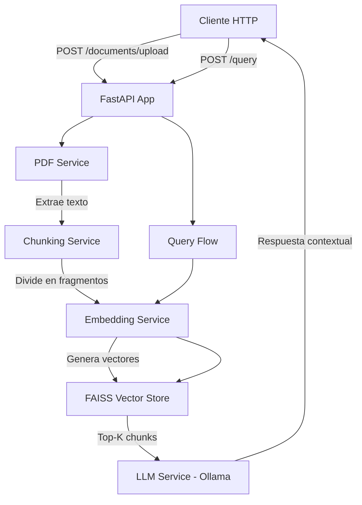

# RAG PDF System con FastAPI

Sistema de **Retrieval-Augmented Generation (RAG)** que permite cargar documentos PDF y realizar consultas en lenguaje natural sobre su contenido. El sistema responde exclusivamente basándose en la información contenida en los documentos, evitando alucinaciones mediante el uso de contexto recuperado.

## 🎯 Características

- **100% Local**: No requiere servicios pagos ni APIs comerciales
- **Sin Alucinaciones**: Responde solo con información de los documentos cargados
- **Arquitectura Modular**: Código limpio y mantenible siguiendo principios SOLID
- **Type-Safe**: Validación automática con Pydantic
- **Logging Completo**: Trazabilidad de todas las operaciones
- **Persistencia**: Índice vectorial guardado en disco
- **API RESTful**: Documentación automática con Swagger/OpenAPI

## 🏗️ Arquitectura



### Flujo de Procesamiento

#### 1. Carga de Documentos
1. Usuario sube PDF mediante `/documents/upload`
2. **PDFService** extrae texto completo usando `pdfplumber`
3. **ChunkingService** divide el texto en fragmentos con solapamiento
4. **EmbeddingService** genera embeddings con `sentence-transformers`
5. **VectorStore** almacena vectores en índice FAISS
6. Índice se guarda en disco para persistencia

#### 2. Consulta de Documentos
1. Usuario envía pregunta en `/query`
2. **EmbeddingService** genera embedding de la pregunta
3. **VectorStore** busca los K fragmentos más similares
4. Fragmentos se combinan como contexto
5. **LLMService** genera respuesta usando Ollama
6. Si no hay contexto relevante, lo indica explícitamente

## 🛠️ Stack Tecnológico

| Componente | Tecnología | Justificación |
|------------|------------|---------------|
| **Backend** | FastAPI | Async, validación automática, documentación integrada |
| **PDF Parsing** | pdfplumber | Robusto, maneja tablas y layouts complejos |
| **Embeddings** | sentence-transformers | Modelo open-source ligero (`all-MiniLM-L6-v2`) |
| **Vector Store** | FAISS | Eficiente, local, 100% gratuito |
| **LLM** | Ollama | Ejecución local de modelos (Mistral, LLaMA, Phi) |
| **Validación** | Pydantic | Type-safe, validación automática |
| **Config** | python-dotenv | Variables de entorno |

## 📋 Requisitos Previos

- **Python 3.10+**
- **Ollama** instalado y ejecutándose
- ~500MB de espacio en disco (modelos + datos)

## 🚀 Instalación

### 1. Clonar el repositorio

```bash
git clone https://github.com/tu-usuario/rag-pdf-system.git
cd rag-pdf-system
```

### 2. Crear entorno virtual

```bash
# Windows
python -m venv venv
venv\Scripts\activate

# Linux/Mac
python3 -m venv venv
source venv/bin/activate
```

### 3. Instalar dependencias

```bash
pip install -r requirements.txt
```

### 4. Instalar y configurar Ollama

#### Windows/Mac
1. Descargar desde [ollama.ai](https://ollama.ai)
2. Instalar y ejecutar Ollama
3. Descargar modelo:

```bash
ollama pull mistral:7b
```

#### Linux
```bash
curl -fsSL https://ollama.ai/install.sh | sh
ollama serve
ollama pull mistral:7b
```

### 5. Configurar variables de entorno

```bash
# Copiar archivo de ejemplo
cp .env.example .env

# Editar .env si es necesario (valores por defecto funcionan)
```

**Variables disponibles:**
- `OLLAMA_BASE_URL`: URL de Ollama (default: `http://localhost:11434`)
- `OLLAMA_MODEL`: Modelo a usar (default: `mistral:7b`)
- `EMBEDDING_MODEL`: Modelo de embeddings (default: `all-MiniLM-L6-v2`)
- `CHUNK_SIZE`: Tamaño de chunks (default: `500`)
- `CHUNK_OVERLAP`: Solapamiento (default: `50`)
- `TOP_K_RESULTS`: Fragmentos a recuperar (default: `3`)

## ▶️ Ejecución

### Iniciar el servidor

```bash
uvicorn app.main:app --reload
```

El servidor estará disponible en `http://localhost:8000`

### Documentación interactiva

- **Swagger UI**: http://localhost:8000/docs
- **ReDoc**: http://localhost:8000/redoc

## 📡 Endpoints de la API

### 1. Health Check

**GET** `/health`

Verifica el estado de todos los servicios.

**Respuesta:**
```json
{
  "status": "healthy",
  "ollama_available": true,
  "embedding_model_loaded": true,
  "vector_store_initialized": true
}
```

**Ejemplo con curl:**
```bash
curl http://localhost:8000/health
```

---

### 2. Subir Documento

**POST** `/documents/upload`

Sube y procesa un archivo PDF.

**Request:**
- Content-Type: `multipart/form-data`
- Body: `file` (archivo PDF)

**Respuesta:**
```json
{
  "filename": "documento.pdf",
  "chunks_processed": 42,
  "message": "Document processed successfully"
}
```

**Ejemplo con curl:**
```bash
curl -X POST "http://localhost:8000/documents/upload" \
  -H "accept: application/json" \
  -H "Content-Type: multipart/form-data" \
  -F "file=@ruta/al/documento.pdf"
```

**Ejemplo con Python:**
```python
import requests

with open("documento.pdf", "rb") as f:
    response = requests.post(
        "http://localhost:8000/documents/upload",
        files={"file": f}
    )
    
print(response.json())
```

---

### 3. Consultar Documentos

**POST** `/query`

Realiza una pregunta en lenguaje natural sobre los documentos.

**Request:**
```json
{
  "question": "¿Cuál es el tema principal del documento?"
}
```

**Respuesta:**
```json
{
  "answer": "Basado en los documentos, el tema principal es...",
  "sources": [
    {
      "text": "Fragmento relevante del documento...",
      "score": 0.342
    }
  ],
  "has_context": true
}
```

**Ejemplo con curl:**
```bash
curl -X POST "http://localhost:8000/query" \
  -H "Content-Type: application/json" \
  -d '{"question": "¿Cuál es el tema principal?"}'
```

**Ejemplo con Python:**
```python
import requests

response = requests.post(
    "http://localhost:8000/query",
    json={"question": "¿Cuál es el tema principal del documento?"}
)

result = response.json()
print(f"Respuesta: {result['answer']}")
print(f"Fuentes encontradas: {len(result['sources'])}")
```

## 📁 Estructura del Proyecto

```
rag-pdf-system/
├── app/
│   ├── __init__.py
│   ├── main.py                 # FastAPI app y endpoints
│   ├── config.py               # Configuración con Pydantic
│   ├── models/
│   │   ├── __init__.py
│   │   └── schemas.py          # Modelos Pydantic
│   ├── services/
│   │   ├── __init__.py
│   │   ├── pdf_service.py      # Extracción de texto PDF
│   │   ├── chunking_service.py # División en fragmentos
│   │   ├── embedding_service.py# Generación de embeddings
│   │   ├── vector_store.py     # Gestión FAISS
│   │   └── llm_service.py      # Interacción con Ollama
│   └── utils/
│       ├── __init__.py
│       └── logger.py           # Configuración de logging
├── data/
│   ├── uploaded_pdfs/          # PDFs guardados
│   └── vector_store/           # Índice FAISS persistente
├── .env                        # Variables de entorno
├── .env.example               # Plantilla de configuración
├── .gitignore
├── requirements.txt
└── README.md
```

## 🔍 Decisiones Técnicas

### ¿Por qué RAG?

RAG (Retrieval-Augmented Generation) combina búsqueda de información con generación de lenguaje:
- **Reduce alucinaciones**: El modelo solo usa información real
- **Actualizable**: Sin reentrenar, solo añadir documentos
- **Transparencia**: Se ven las fuentes usadas

### ¿Por qué FAISS?

- **Local**: No envía datos a servicios externos
- **Eficiente**: Optimizado por Facebook AI
- **Escalable**: Maneja millones de vectores
- **Gratuito**: 100% open-source

### ¿Por qué Ollama?

- **Privacidad**: LLM ejecutado localmente
- **Gratuito**: Sin límites de API
- **Fácil**: Instalación simple
- **Flexible**: Soporta múltiples modelos

### Estrategia de Chunking

- **Tamaño**: 500 caracteres (balance contexto/precisión)
- **Overlap**: 50 caracteres (preserva contexto entre chunks)
- **Trade-off**: Chunks grandes = más contexto pero menos precisión

### Prompt Engineering

El prompt instruye al LLM a:
1. Usar **solo** el contexto proporcionado
2. Indicar cuando no tiene información
3. No usar conocimiento externo
4. Citar el contexto cuando sea relevante

## ⚠️ Limitaciones Conocidas

1. **Dependencia de Ollama**: Requiere que Ollama esté ejecutándose
2. **Memoria**: Modelos LLM grandes requieren 8GB+ RAM
3. **Solo PDFs**: No soporta otros formatos (Word, HTML, etc.)
4. **Idioma**: Funciona mejor en inglés (depende del modelo)
5. **Tamaño de contexto**: Limitado por el modelo LLM usado

## 🧪 Testing

### Test manual básico

1. **Health check**:
```bash
curl http://localhost:8000/health
```

2. **Subir PDF de prueba**:
```bash
curl -X POST "http://localhost:8000/documents/upload" \
  -F "file=@test.pdf"
```

3. **Query con respuesta esperada**:
```bash
curl -X POST "http://localhost:8000/query" \
  -H "Content-Type: application/json" \
  -d '{"question": "pregunta sobre contenido conocido"}'
```

4. **Query fuera de contexto** (debe indicar que no tiene información):
```bash
curl -X POST "http://localhost:8000/query" \
  -H "Content-Type: application/json" \
  -d '{"question": "¿Quién ganó el mundial 2022?"}'
```

## 🔧 Troubleshooting

### Error: "Ollama is not available"

**Solución**: Verificar que Ollama esté ejecutándose:
```bash
# Verificar proceso
# Windows: Task Manager
# Linux/Mac:
ps aux | grep ollama

# Reiniciar Ollama
ollama serve
```

### Error: "No text could be extracted from PDF"

**Causas posibles**:
- PDF escaneado (solo imágenes, sin texto)
- PDF corrupto
- PDF protegido con contraseña

**Solución**: Usar PDF con texto extraíble o aplicar OCR previamente

### Error: "Vector store is empty"

**Causa**: No se han subido documentos

**Solución**: Subir al menos un PDF usando `/documents/upload`

### Lentitud en primera ejecución

**Causa**: Primera descarga del modelo de embeddings (~80MB)

**Solución**: Esperar a que se complete la descarga (solo ocurre una vez)

## 📈 Próximas Mejoras

- [ ] Soporte para múltiples formatos (DOCX, TXT, HTML)
- [ ] OCR para PDFs escaneados
- [ ] Interfaz web (frontend)
- [ ] Autenticación y multi-usuario
- [ ] Métricas y analytics
- [ ] Tests unitarios y de integración
- [ ] Docker Compose completo
- [ ] Soporte para chat conversacional (historial)

## 👨‍💻 Autor

**Lucia** - Desarrollador Python | Backend | Generative AI

- GitHub: [tu-usuario](https://github.com/tu-usuario)
- LinkedIn: [tu-perfil](https://linkedin.com/in/tu-perfil)

## 📄 Licencia

Este proyecto está bajo la Licencia MIT - ver el archivo [LICENSE](LICENSE) para detalles.

## 🙏 Agradecimientos

- [FastAPI](https://fastapi.tiangolo.com/)
- [FAISS](https://faiss.ai/)
- [Sentence Transformers](https://www.sbert.net/)
- [Ollama](https://ollama.ai/)
- [pdfplumber](https://github.com/jsvine/pdfplumber)

---

¿Tienes preguntas o sugerencias? [Abre un issue](https://github.com/tu-usuario/rag-pdf-system/issues) 🚀
